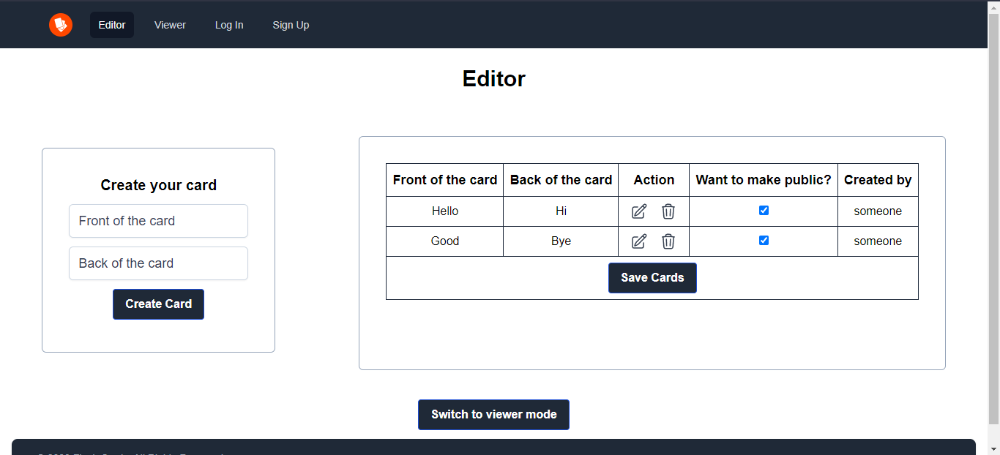
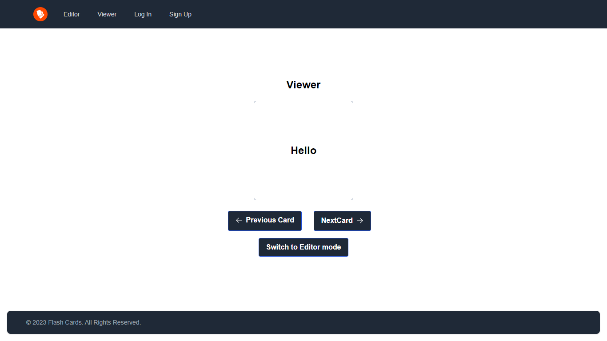
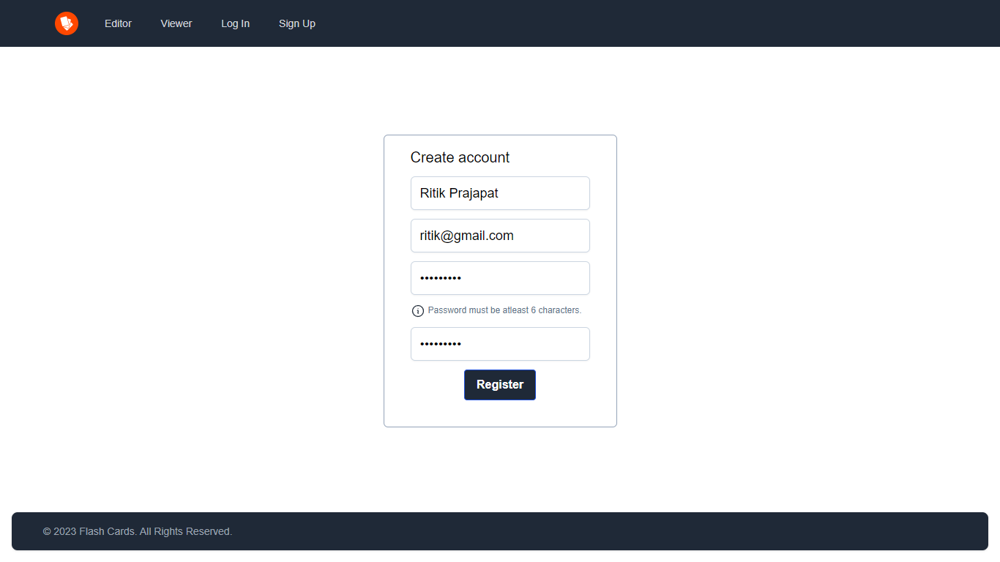
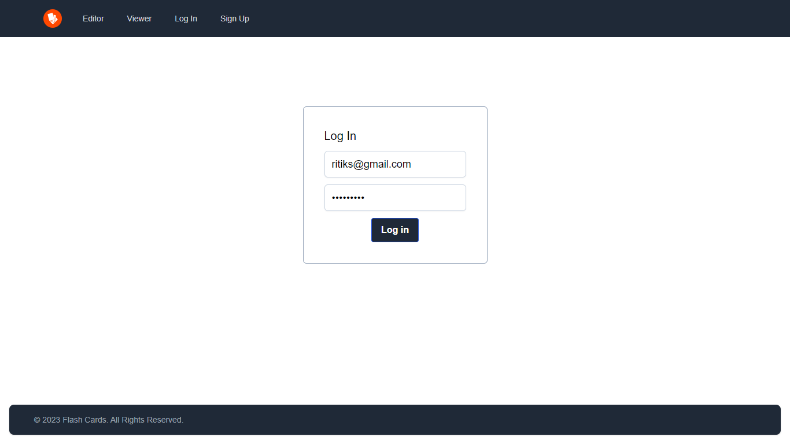

# Flash Memo

This is an application that let's you create flash cards.


## Tech Stack Used
- React
- Node
- MongoDB

## Library Used
- react-router-dom
- react-hot-toast
- uuid
- formik
- axios
- tailwindcss
- bcyrpt
- cors
- jsonwebtoken
- mongoose
- nodemon
- morgon

## Screenshots










## Run Locally

Clone the project

```bash
  git clone https://https://github.com/ritikprajapat21/FlashCard.git
```

Go to the project directory

```bash
  cd FlashCard
```
Go to the client directory

```bash
  cd client
```
and run following command

```bash
  npm install
```

Go to the server directory

```bash
  cd server
```

and run following command

```bash
  npm install
```

To run the app type following command in both directory

```bash
  npm start
```

## Bug/Help Needed
- Most Important, in **UI**
